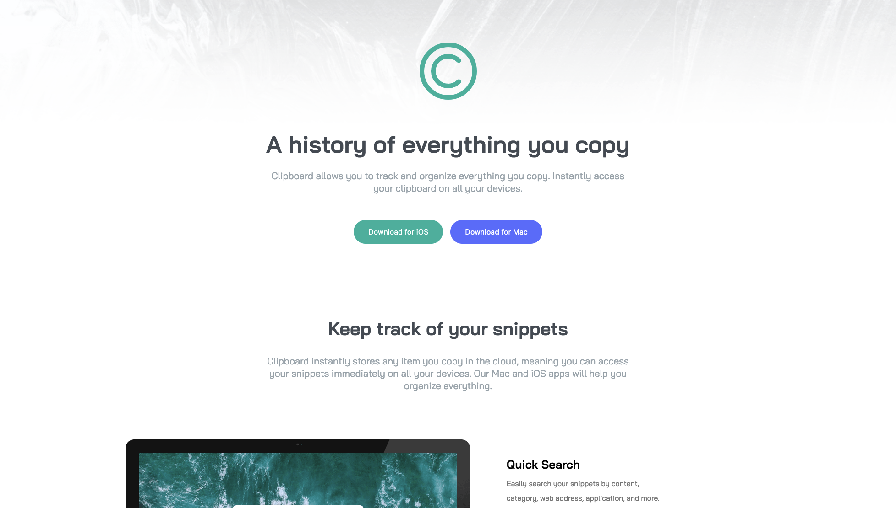

<h1 align="center">Clipboard Landing Page</h1>

 <a align="center" href="https://ctrlaltsudo.github.io/Clipboard-landing-page/">Live Demo</a>

 <a align="center" href="https://www.frontendmentor.io/challenges/clipboard-landing-page-5cc9bccd6c4c91111378ecb9/hub">Solution Page</a>

<h2 align="center">Project Screenshot<h2>

  </img>

## Description

This is a Frontend Mentor challenge, click the link above to visit the challenge page. 

## Built with 

HTML

CSS

Flexbox

## What I learnt 

This is the biggest challenge I've taken from Frontend Mentor so far, I think this was good practise for using specificity in CSS.

## Authors

<a href="https://github.com/CtrlAltSudo">CtrlAltSudo</a>.

## Acknowledgments

Stack overflow and ChatGPT still prove to be valuable resources! 